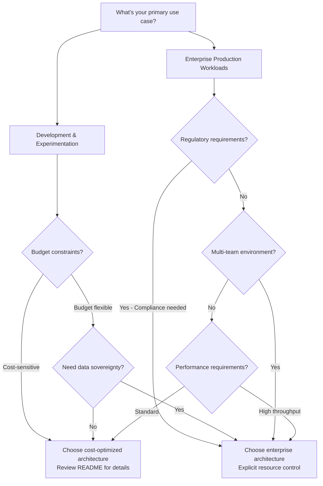

# Getting Started with CAIRA

Welcome to CAIRA (Composable AI Reference Architecture)! This guide will help you get up and running with deploying secure, enterprise-grade AI infrastructure on Azure.

## What is CAIRA?

CAIRA is a modular, infrastructure-as-code baseline that accelerates the deployment of secure, observable AI-related environments in the cloud. It provides reference architectures that you can explore by checking the `reference_architectures/` directory:

```bash
ls reference_architectures/
```

Each architecture is designed for different use cases and requirements. Review each architecture's README.md to understand its purpose, components, and target scenarios.

## Prerequisites

Before you begin, ensure you have:

1. **Azure Account**: Active Azure subscription with appropriate permissions
1. **Development Environment**: Either use our devcontainer (recommended) or set up your local environment
1. **Basic Knowledge**: Familiarity with Azure, Terraform, and infrastructure concepts

For detailed setup instructions, see our [Environment Setup Guide](../../docs/environment_setup.md).

## Choose Your Learning Path

CAIRA provides tailored guidance based on your role, experience level, and objectives. **ALWAYS present ALL relevant learning paths with clear explanations**, then **explicitly ask the user to choose** before proceeding with path-specific guidance. Select the learning path that best matches your needs for the most effective onboarding experience.

**CRITICAL**: Wait for explicit user confirmation of their chosen learning path before providing detailed guidance. Do not assume or auto-select a path.

### Quick Deployer Path - "I Need AI Infrastructure Now"

**Perfect for**: Project managers, solution architects, teams needing rapid AI environment deployment

**Timeline**: 30-60 minutes to working AI infrastructure

**Your Journey:**

1. **Environment Setup** (10 minutes)
   - Use the devcontainer for zero-setup experience (see [Environment Setup Guide](../../docs/environment_setup.md))
   - Or install Azure CLI + Terraform locally
   - Complete Azure authentication

1. **Deploy Your AI Infrastructure** (20-50 minutes)
   - Follow the comprehensive [Deployment Guide](deploy.md) for step-by-step instructions
   - **Process includes**: Architecture selection, variable configuration, plan review, and deployment
   - **Choose based on needs**: Development/experimentation vs. enterprise/regulated workloads

1. **Immediate Value**
   - Access AI Foundry Portal through Azure Portal
   - Choose and configure available, platform-managed model options in AI Foundry Portal; available model choices may change over time—refer to the Studio or the architecture README for current defaults.
   - Ready for AI application development
   - Built-in monitoring with Application Insights

**Success Criteria**: Working AI infrastructure deployed and accessible within 1 hour

### Solution Customizer Path - "I Need Tailored Infrastructure"

**Perfect for**: Infrastructure engineers, cloud architects building custom AI solutions

**Timeline**: 2-4 hours for custom solution design and deployment

**Your Journey:**

1. **Architecture Understanding** (30 minutes)
   - Study [AI Foundry module](../../modules/ai_foundry/README.md) and [Common Models module](../../modules/common_models/README.md)
   - Review how reference architectures compose modules
   - Understand deployment patterns and configuration options

1. **Solution Design** (60 minutes)
   - Review available architectures and **wait for user confirmation** before choosing the foundation for your needs
   - **MANDATORY**: Present ALL relevant architectures with clear explanations, then **explicitly ask the user to choose** before proceeding
   - Plan specific AI model requirements using available modules
   - Consider environment-specific requirements (dev vs prod configurations)

1. **Custom Implementation** (90-120 minutes)
   - Start with the reference architecture that best matches your requirements
   - Customize model deployments and project configurations
   - Add specific compliance and security requirements
   - Configure monitoring and observability features

1. **Advanced Features**
   - Implement data sovereignty patterns based on architecture capabilities
   - Configure customer-managed keys and compliance features
   - Set up monitoring for production workloads

**Success Criteria**: Customized AI infrastructure meeting specific requirements and ready for production use

### Active Contributor Path - "I Want to Extend CAIRA"

**Perfect for**: Software engineers, DevOps engineers, infrastructure developers

**Timeline**: 1-2 days for full development environment and first contribution

**Your Journey:**

1. **Development Environment** (30 minutes)
   - Follow [Developer Guide](../../docs/developer.md) for complete toolchain setup
   - Use devcontainer for consistent environment with all tools pre-installed
   - Understand project development workflow and standards

1. **Codebase Deep Dive** (3-4 hours)
   - Study module structure and design patterns in AI Foundry and Common Models modules
   - Review coding standards and Terraform conventions
   - Explore testing and validation framework in `testing/`
   - Understand CI/CD pipelines and quality gates

1. **Contribution Workflow** (2-3 hours)

   ```bash
   task tools    # Install development dependencies
   task lint     # Validate code quality
   ```

   - Follow [Development Workflow](../../docs/contributing/development_workflow.md) for branch management
   - Use [Pull Request Guide](../../docs/contributing/pull_request_guide.md) for submissions
   - Understand [Code Review Guidelines](../../docs/contributing/code_review_guidelines.md)

1. **Advanced Development**
   - Create new modules following established patterns
   - Extend reference architectures for new use cases
   - Participate in architectural decision records (ADRs)

**Success Criteria**: Successful contribution merged into CAIRA with understanding of development workflow

### Knowledge Explorer Path - "I Want to Learn Modern AI Infrastructure"

**Perfect for**: Students, researchers, professionals learning cloud-native AI patterns

**Timeline**: Ongoing learning journey with immediate hands-on experience

**Your Journey:**

1. **Conceptual Foundation** (1-2 hours)
   - Study CAIRA's modular architecture philosophy
   - Understand Azure Well-Architected Framework implementation
   - Learn enterprise-grade security patterns for AI workloads

1. **Hands-On Learning** (Ongoing)
   - Deploy reference architectures to see concepts in action
   - Modify configurations to understand component interactions
   - Experiment with different environment configurations

1. **Advanced Topics** (Progressive)
   - Explore sophisticated networking patterns with private endpoints
   - Study customer-managed encryption and compliance features
   - Learn multi-tenant AI platform design with Azure AI Foundry
   - Understand traffic orchestration and AI gateway patterns

1. **Real-World Application**
   - Build proof-of-concept solutions using CAIRA modules
   - Understand enterprise deployment patterns and best practices
   - Learn from architectural decision records and design rationale

**Success Criteria**: Comprehensive understanding of modern AI infrastructure patterns and ability to design solutions

### Learning Accelerators

**Essential Documentation Flow:**

1. Start with [main README](../../README.md) for project overview
1. Review [Environment Setup](../../docs/environment_setup.md) for tooling
1. Explore specific module READMEs for technical details
1. Reference [Troubleshooting Guide](../../docs/troubleshooting.md) when needed
1. Follow [Development Workflow](../../docs/contributing/development_workflow.md) for contributing

**Key Success Factors:**

- **Start Simple**: Begin with reference architectures before custom solutions
- **Security First**: Understand built-in security patterns and compliance features
- **Iterative Approach**: Deploy basic configurations first, then add complexity
- **Community Engagement**: Use issues and discussions for questions and feedback

## Architecture Selection Guide

Choose the right CAIRA architecture based on your specific requirements and constraints. **ALWAYS present ALL relevant architectures that match the user's stated requirements** with clear explanations, then **explicitly ask the user to choose** before proceeding to deployment guidance. First, check what architectures are available:

```bash
ls reference_architectures/
```

Then review each architecture's README.md file to understand:

- **Target use cases and scenarios**
- **Component descriptions and configurations**
- **Security and compliance features**
- **Cost considerations**
- **Prerequisites and limitations**

### Decision Framework

**Start Here: What's your primary use case?**



### Architecture Evaluation Criteria

When comparing available architectures, consider these factors:

| Consideration | Questions to Ask | Look For in README |
|---------------|------------------|--------------------|
| **Cost** | What's my budget? | Pricing tier information, resource optimization |
| **Data Sovereignty** | Do I need explicit data control? | Resource management capabilities, compliance features |
| **Setup Complexity** | How quickly do I need to deploy? | Prerequisites, configuration requirements |
| **Team Support** | Single team or multi-team? | Access control patterns, sharing capabilities |
| **Compliance** | What regulations apply? | Security features, audit capabilities |
| **Performance** | What are my throughput needs? | Resource allocation, scalability features |

## Quick Start Steps

> **New to CAIRA?** Check out our [learning paths](#choose-your-learning-path) above for guided experiences tailored to your role and objectives.

For immediate deployment overview:

### 1. Setup Environment

- Use devcontainer (recommended) or follow [Environment Setup Guide](../../docs/environment_setup.md)
- Ensure Azure CLI, Terraform, and Git are available

### 2. Choose Architecture

- Explore available architectures: `ls reference_architectures/`
- Review each architecture's README.md for use cases and requirements
- Select based on your specific needs (development vs. enterprise, compliance requirements, etc.)

### 3. Deploy

- Follow the comprehensive [Deployment Guide](deploy.md) for step-by-step instructions
- **Key highlights from deployment process:**
  - Architecture selection with user confirmation
  - Azure authentication setup
  - Terraform variable configuration
  - Plan review and deployment execution
  - Post-deployment verification

## Architecture Details

Each reference architecture in the `reference_architectures/` directory is designed for specific use cases and requirements. To understand the details of each architecture:

1. **Explore Available Architectures**:

   ```bash
   ls reference_architectures/
   ```

1. **Review Architecture Documentation**: Each architecture includes:
   - **README.md**: Complete architecture details, components, and use cases
   - **Architecture diagrams**: Visual representations of the deployed infrastructure
   - **Configuration examples**: Sample terraform.tfvars configurations
   - **Prerequisites**: Required tools and permissions

1. **Understand Components**: Each architecture README will detail:
   - **Purpose**: Target use cases and scenarios
   - **Components**: What Azure services and resources are deployed
   - **Configuration**: Available customization options
   - **Security**: Built-in security patterns and compliance features

## Key Components

The components deployed by each architecture vary based on the architecture's purpose and target use cases. Common components across CAIRA architectures typically include:

| Component Category | Purpose | Notes |
|-------------------|---------|-------|
| **AI Foundry Resources** | Central AI platform with model deployments | Core component in most architectures |
| **AI Projects** | Workspace for organizing AI work | Project-based organization |
| **Model Deployments** | Pre-deployed AI models | Architecture-specific model selections |
| **Monitoring & Observability** | Application performance monitoring | Varies by architecture complexity |
| **Data Services** | Database and storage services | Some architectures include dedicated services |
| **Search Services** | Search capabilities for AI applications | Architecture-dependent |

**To see specific components for each architecture**, review the individual README.md files in the `reference_architectures/` directory.

## Next Steps After Deployment

1. **Verify Deployment**: Check Azure Portal for created resources
1. **Access Services**:
   - For private deployments: Set up VPN connectivity
   - Test OpenAI endpoints and AI Search services
1. **Explore Documentation**:
   - [Developer Guide](../../docs/developer.md) for advanced usage
   - [Security Practices](../../SECURITY.md) for security guidance
1. **Start Building**: Begin developing your AI applications using the deployed infrastructure

## Common Configuration Options

Each architecture supports customization through Terraform variables. Refer to the architecture-specific README files for detailed configuration options available for your chosen architecture.

Example basic configuration pattern:

```hcl
# Basic Configuration
location = "swedencentral"

# Architecture-specific variables
# (see individual architecture README for available options)
```

## Troubleshooting

If you encounter issues:

1. **Check Prerequisites**: Ensure Azure CLI is logged in and subscription is set
1. **Review Logs**: Check Terraform output for specific error messages
1. **Consult Documentation**:
   - [Troubleshooting Guide](../../docs/troubleshooting.md)
   - Architecture-specific README files
1. **Get Help**: Review [Contributing Guidelines](../../CONTRIBUTING.md) for support options

## Cleanup

To remove deployed resources:

```bash
# Using Terraform (recommended)
terraform destroy

# Or delete resource group in Azure Portal
az group delete --name <resource-group-name>
```

## Learning Resources

- **CAIRA Overview**: [Main README](../../README.md)
- **Security Guidelines**: [Security Practices](../../SECURITY.md)
- **Development Workflow**: [Contributing Guide](../../docs/contributing/development_workflow.md)

## Support

For questions and support:

- Review existing documentation in the `docs/` directory
- Check the [Troubleshooting Guide](../../docs/troubleshooting.md)
- See [Contributing Guidelines](../../CONTRIBUTING.md) for community support options
